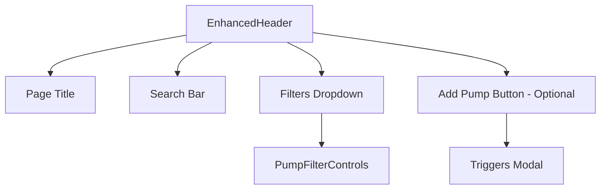
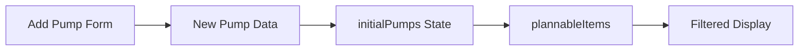

# Header Reorganization and Add Pump Migration Plan

## Overview
This document outlines the plan to reorganize the Add Pump functionality from the Kanban page to the Schedule page, and standardize headers across both pages with consistent filtering and search capabilities.

## Current State Analysis

### Kanban Page (src/app/page.tsx)
- **Header**: Uses `Header` component with Add Pump button and comprehensive filters
- **Filters**: Serial number, customer, PO number, model, powder coater, priority
- **Add Pump**: Modal-based form that adds pumps to "Open Jobs" stage
- **Search**: No search functionality currently

### Schedule Page (src/app/schedule/page.tsx)
- **Header**: Custom header with basic title and stats
- **Filters**: Limited filters (customer, model, PO number, priority) in plannable pumps section
- **Search**: Local search bar in plannable pumps table
- **Add Pump**: No Add Pump functionality

## Target State

### Both Pages Should Have
- **Consistent Header Layout**: `Page Title | Search Bar | Filters Button | [Add Pump (Schedule only)]`
- **Comprehensive Filtering**: All filter types from Kanban page
- **Search Functionality**: Global search across all pump data

### Schedule Page Specific
- **Add Pump Button**: Moved from Kanban page
- **Add Pump Modal**: Full functionality for creating new pumps

### Kanban Page Specific
- **No Add Pump**: Button and modal removed
- **Enhanced Search**: New search functionality added to header

## Implementation Plan

### Phase 1: Create Enhanced Header Component

#### 1.1 New Component: `src/components/layout/EnhancedHeader.tsx`
```typescript
interface EnhancedHeaderProps {
  title: string;
  showAddPump?: boolean;
  onAddPump?: () => void;
  searchTerm: string;
  onSearchChange: (term: string) => void;
  filters: Filters;
  onFiltersChange: (filters: Filters) => void;
  availablePumpModels: string[];
  availablePowderCoaters: string[];
  availableCustomers: string[];
  availableSerialNumbers: string[];
  availablePONumbers: string[];
  availablePriorities: { label: string; value: string }[];
}
```

**Features:**
- Configurable page title
- Search bar with real-time filtering
- Comprehensive filter dropdown (from Kanban page)
- Optional Add Pump button
- Consistent styling and layout
- Responsive design

#### 1.2 Component Architecture


### Phase 2: Update Schedule Page

#### 2.1 Header Integration
- **Remove**: Custom header section (lines 681-693)
- **Add**: EnhancedHeader component with:
  - Title: "Production Planning & Schedule"
  - Search functionality
  - Comprehensive filters
  - Add Pump button

#### 2.2 Filter System Migration
- **Remove**: Current filter controls from PlannablePumpsTable
- **Remove**: Local search bar from plannable pumps section
- **Update**: Filter logic to use comprehensive filter system
- **Maintain**: Clear filters functionality

#### 2.3 Add Pump Integration
- **Import**: AddPumpForm component
- **Add**: Modal state management
- **Implement**: handleAddPump function
- **Integrate**: New pumps into existing data flow

#### 2.4 Data Flow Updates


### Phase 3: Update Kanban Page

#### 3.1 Header Migration
- **Replace**: Current Header component with EnhancedHeader
- **Add**: Search functionality
- **Remove**: Add Pump button
- **Maintain**: All existing filter functionality

#### 3.2 Add Pump Removal
- **Remove**: AddPumpForm import and usage
- **Remove**: isAddPumpModalOpen state
- **Remove**: handleAddPump function
- **Remove**: Add Pump modal JSX

#### 3.3 Search Integration
- **Add**: Search state management
- **Update**: Filter logic to include search
- **Implement**: Real-time search across pump data

### Phase 4: Component Details

#### 4.1 EnhancedHeader Layout
```
┌─────────────────────────────────────────────────────────────────┐
│ [Sidebar] Page Title    [Search Bar]  [Filters (N)] [Add Pump] │
└─────────────────────────────────────────────────────────────────┘
```

#### 4.2 Filter Integration
- **Reuse**: Existing PumpFilterControls component
- **Extend**: Filter logic to work with search
- **Maintain**: Filter state consistency

#### 4.3 Search Functionality
- **Global Search**: Across all pump fields
- **Real-time**: Updates as user types
- **Combined**: Works with existing filters

### Phase 5: File Modifications

#### New Files
1. `src/components/layout/EnhancedHeader.tsx` - New enhanced header component

#### Modified Files
1. `src/app/page.tsx` - Kanban page updates
   - Replace Header with EnhancedHeader
   - Add search functionality
   - Remove Add Pump functionality

2. `src/app/schedule/page.tsx` - Schedule page updates
   - Add EnhancedHeader
   - Remove current filters
   - Add Add Pump functionality
   - Integrate comprehensive filtering

#### Potentially Deprecated
1. `src/components/layout/Header.tsx` - May be deprecated if no longer used

### Phase 6: Testing Strategy

#### Functionality Testing
- [ ] Add Pump works correctly on Schedule page
- [ ] Add Pump removed from Kanban page
- [ ] Search functionality works on both pages
- [ ] Comprehensive filters work on both pages
- [ ] Filter state management is consistent

#### UI/UX Testing
- [ ] Headers have identical layouts
- [ ] Responsive design works on both pages
- [ ] Filter dropdown behavior is consistent
- [ ] Search bar behavior is consistent

#### Data Flow Testing
- [ ] New pumps appear in correct locations
- [ ] Filter combinations work correctly
- [ ] Search + filter combinations work
- [ ] Drag and drop still functions on Schedule page

## Benefits

### User Experience
- **Consistent Interface**: Identical header layouts across pages
- **Logical Workflow**: Add Pump where scheduling decisions are made
- **Enhanced Search**: Search functionality on Kanban page
- **Better Filtering**: Comprehensive filters on Schedule page

### Technical Benefits
- **Code Reuse**: Shared header component
- **Maintainability**: Single source of truth for header logic
- **Consistency**: Standardized filter and search behavior
- **Scalability**: Easy to add new pages with consistent headers

## Implementation Order

1. **Create EnhancedHeader component**
2. **Update Schedule page** (add functionality)
3. **Update Kanban page** (remove functionality)
4. **Test and refine**
5. **Clean up deprecated code**

## Risk Mitigation

### Potential Issues
- **State Management**: Ensure filter/search state doesn't conflict
- **Data Flow**: Verify pump creation works correctly on Schedule page
- **Performance**: Ensure search doesn't impact performance
- **Responsive Design**: Verify header works on all screen sizes

### Mitigation Strategies
- **Incremental Implementation**: Update one page at a time
- **Thorough Testing**: Test each phase before proceeding
- **Backup Plan**: Keep original components until migration is complete
- **User Feedback**: Validate UX improvements with stakeholders

## Success Criteria

- [ ] Schedule page has Add Pump functionality
- [ ] Kanban page has no Add Pump functionality
- [ ] Both pages have identical header layouts
- [ ] Both pages have comprehensive filtering
- [ ] Both pages have search functionality
- [ ] All existing functionality is preserved
- [ ] User experience is improved
- [ ] Code is more maintainable

## Timeline

- **Phase 1-2**: Create component and update Schedule page
- **Phase 3**: Update Kanban page
- **Phase 4-6**: Testing and refinement

This plan ensures a systematic approach to reorganizing the functionality while maintaining code quality and user experience.