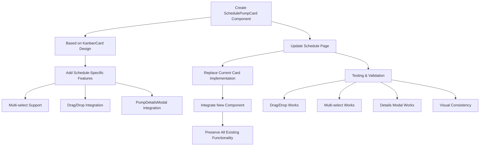

# Schedule Pump Cards Redesign Plan

## Overview
Update the pump cards on the schedule page to be identical to the Kanban page cards while maintaining all drag and drop scheduling functionality. This will improve space utilization, provide visual consistency, and enhance user experience.

## Current State Analysis

### Schedule Page (Current)
- Uses large, detailed cards with table-like layout
- Shows all pump information in expanded format
- Takes up significant space limiting card density
- Custom card design different from Kanban

### Kanban Page (Target Design)
- Compact, clean card design with streamlined layout
- Header shows: Model + Customer, Serial Number
- Eye button for viewing detailed information
- GripVertical icon for drag indication
- Priority-based border styling

### Requirements
- ✅ Make schedule pump cards identical to Kanban cards
- ✅ Maintain drag and drop scheduling functionality
- ✅ Preserve multi-select capability (Ctrl/Meta+Click)
- ✅ Add Eye button with pump details modal
- ✅ Improve space utilization (fit more cards)
- ✅ Keep calendar day cards unchanged (they need to be compact)

## Implementation Strategy



## Detailed Implementation Steps

### Phase 1: Create Schedule Pump Card Component

**File**: `src/components/schedule/SchedulePumpCard.tsx`

1. **Base Design**
   - Copy structure from `src/components/kanban/KanbanCard.tsx`
   - Maintain compact header layout: Model + Customer, Serial Number
   - Keep priority-based border styling (`border-orange-500` for high, `border-red-600` for urgent)
   - Add Eye button for details modal
   - Include GripVertical icon for drag indication

2. **Schedule-Specific Features**
   - Support multi-select functionality with selection rings
   - Custom click handlers for Ctrl/Meta+Click behavior
   - Integrate with existing drag/drop system
   - Show selection state visually (`ring-2 ring-primary ring-offset-1`)

3. **Component Interface**
   ```typescript
   interface SchedulePumpCardProps {
     pump: PlannablePump;
     isSelected: boolean;
     onCardClick: (pump: PlannablePump, event: React.MouseEvent) => void;
     onDragStart: (e: React.DragEvent, pump: PlannablePump) => void;
     onOpenDetailsModal: (pump: PlannablePump) => void;
   }
   ```

4. **Key Features**
   - Hover effects: `hover:shadow-lg hover:scale-[1.02]`
   - Drag visual feedback: opacity changes during drag
   - Accessibility: proper ARIA labels
   - Tooltip integration for Eye and Grip icons

### Phase 2: Update Schedule Page Integration

**File**: `src/app/schedule/page.tsx`

1. **Add PumpDetailsModal State Management**
   ```typescript
   const [selectedPumpForDetails, setSelectedPumpForDetails] = useState<PlannablePump | null>(null);
   const [isDetailsModalOpen, setIsDetailsModalOpen] = useState(false);
   ```

2. **Add Details Modal Handler**
   ```typescript
   const handleOpenDetailsModal = useCallback((pump: PlannablePump) => {
     setSelectedPumpForDetails(pump);
     setIsDetailsModalOpen(true);
   }, []);

   const handleUpdatePump = useCallback((updatedPump: Pump) => {
     // Update pump in plannableItems state
     setInitialPumps(prev => prev.map(p => p.id === updatedPump.id ? updatedPump : p));
   }, []);
   ```

3. **Replace Current Card Implementation**
   - Remove current detailed card layout (lines ~514-566)
   - Replace with new `SchedulePumpCard` component
   - Update grid layout for better space utilization

4. **Integration Points**
   - Connect to existing `handlePlannableItemClick` (line 150)
   - Connect to existing `handleDragStartPlannableItem` (line 163)
   - Add PumpDetailsModal component at bottom of JSX

### Phase 3: Layout Optimization

1. **Card Container Updates**
   - Change from single column to responsive grid
   - Adjust spacing for higher card density
   - Maintain smooth scrolling and overflow handling

2. **Grid Layout**
   ```typescript
   // Replace current card layout with:
   <div className="grid grid-cols-1 md:grid-cols-2 lg:grid-cols-3 gap-3 p-4">
     {filteredPlannableItems.map(item => (
       <SchedulePumpCard
         key={item.id}
         pump={item}
         isSelected={selectedPlannableItemIds.includes(item.id)}
         onCardClick={handlePlannableItemClick}
         onDragStart={handleDragStartPlannableItem}
         onOpenDetailsModal={handleOpenDetailsModal}
       />
     ))}
   </div>
   ```

3. **PumpDetailsModal Integration**
   ```typescript
   <PumpDetailsModal
     isOpen={isDetailsModalOpen}
     onClose={() => setIsDetailsModalOpen(false)}
     pump={selectedPumpForDetails}
     onUpdatePump={handleUpdatePump}
   />
   ```

### Phase 4: Testing & Validation

1. **Functionality Verification**
   - ✅ Drag and drop to calendar works (existing dataTransfer logic preserved)
   - ✅ Multi-select with Ctrl/Meta+Click works
   - ✅ Details modal opens and updates pumps correctly
   - ✅ Filtering and searching continues to work
   - ✅ Visual feedback during drag operations maintained
   - ✅ Batch drag operations work correctly

2. **Visual Validation**
   - ✅ Cards look identical to Kanban cards
   - ✅ More cards fit in allocated space
   - ✅ Consistent spacing and alignment
   - ✅ Proper responsive behavior (1 col mobile, 2 col tablet, 3 col desktop)
   - ✅ Priority borders display correctly
   - ✅ Selection rings appear properly

3. **Edge Cases**
   - Empty state handling
   - Long customer/model names truncation
   - Mobile touch interactions
   - Keyboard navigation support

## Benefits of This Approach

1. **🎯 Space Optimization**: Compact Kanban-style design fits ~3x more cards
2. **🎨 UI Consistency**: Identical look and feel between Kanban and Schedule pages
3. **👁️ Enhanced UX**: Eye button provides easy access to detailed pump information
4. **🔄 Preserved Functionality**: All existing drag/drop and selection features maintained
5. **🧩 Reusable Design**: Consistent card pattern across the application
6. **📱 Better Responsive**: Grid layout works better on all screen sizes

## Files to be Modified/Created

### New Files
- `src/components/schedule/SchedulePumpCard.tsx` - New pump card component

### Modified Files
- `src/app/schedule/page.tsx` - Integration and layout updates

### Unchanged Files
- `src/components/pump/PumpDetailsModal.tsx` - Reused as-is
- `src/components/kanban/KanbanCard.tsx` - Reference design (unchanged)
- Calendar day cards - Keep existing compact design for space constraints

## Implementation Considerations

1. **Backward Compatibility**: All existing functionality preserved
2. **Performance**: No negative impact on drag/drop performance
3. **Accessibility**: Maintain ARIA labels and keyboard navigation
4. **Mobile Responsiveness**: Cards adapt to smaller screens appropriately
5. **State Management**: Clean integration with existing state patterns
6. **Type Safety**: Proper TypeScript interfaces and type checking

## Technical Notes

### Drag/Drop Functionality Preservation
- Maintain existing `dataTransfer.setData()` calls
- Preserve `handleDragStartPlannableItem` logic for both single and batch operations
- Keep visual feedback system (opacity changes)
- Maintain drop zone event handlers

### Multi-Select Behavior
- Ctrl/Meta+Click functionality preserved exactly as-is
- Selection state managed through existing `selectedPlannableItemIds` array
- Visual selection feedback through ring styling

### Modal Integration
- Reuse existing `PumpDetailsModal` component without modifications
- Add proper state management for modal open/close
- Implement pump update callback to sync changes back to schedule state

## Success Criteria

1. **Visual**: Cards look identical to Kanban page cards
2. **Functional**: All drag/drop operations work exactly as before
3. **Spatial**: More cards visible in same screen space
4. **Interactive**: Details modal works seamlessly
5. **Responsive**: Good experience on all device sizes
6. **Performance**: No regression in drag/drop responsiveness

## Next Steps

1. Create `SchedulePumpCard` component
2. Update schedule page integration
3. Test all functionality thoroughly
4. Validate visual consistency
5. Deploy and gather user feedback

---

**Plan Created**: 2025-06-04  
**Status**: Ready for Implementation  
**Estimated Effort**: 4-6 hours development + testing